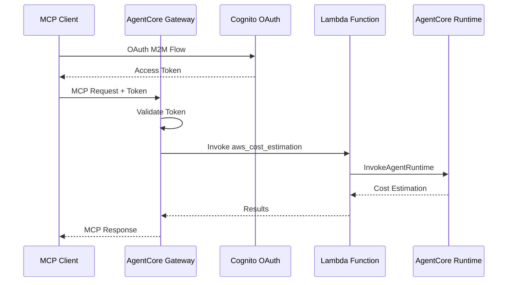

# AgentCore Gateway Integration

[English](README.md) / [日本語](README_ja.md)

This implementation demonstrates **AgentCore Gateway** with Lambda integration that exposes the cost estimator agent from `02_runtime` as an MCP tool with Cognito OAuth authentication.

## Process Overview



## Prerequisites

1. **Runtime deployed** - Complete `02_runtime` setup first
2. **AWS SAM CLI** - For Lambda deployment
3. **AWS credentials** - With Gateway and Lambda permissions
4. **Dependencies** - Installed via `uv` (see pyproject.toml)

## How to use

### File Structure

```
03_gateway/
├── README.md                      # This documentation
├── template.yaml                  # SAM template for Lambda
├── src/app.py                     # Lambda function implementation
├── deploy.sh                      # Lambda deployment script
├── create_gateway.py              # Gateway setup with Cognito
├── test_gateway.py                # Gateway testing suite
└── gateway_config.json            # Generated configuration
```

### Step 1: Deploy Lambda Function

```bash
cd 03_gateway
./deploy.sh
```

This deploys the Lambda function using SAM and saves configuration to `gateway_config.json`.

### Step 2: Create Gateway with Cognito

```bash
cd 03_gateway
uv run create_gateway.py
```

This creates the Gateway with OAuth authentication and Lambda target integration.

### Step 3: Test Gateway Integration

```bash
cd 03_gateway
# Test with MCP protocol
uv run test_gateway.py --tests mcp

# Test with direct API calls
uv run test_gateway.py --tests api
```

## Key Implementation Pattern

### Lambda Function with AgentCore Runtime Integration

```python
def lambda_handler(event, context):
    """Handle aws_cost_estimation tool invocation from Gateway"""
    try:
        # Extract tool name from Gateway context
        tool_name = context.client_context.custom.get('bedrockAgentCoreToolName', '')
        
        # Remove Gateway prefix (format: targetName___toolName)
        if "___" in tool_name:
            tool_name = tool_name.split("___")[-1]
        
        # Verify this is the aws_cost_estimation tool
        if tool_name != 'aws_cost_estimation':
            return {'statusCode': 400, 'body': f"Unknown tool: {tool_name}"}
        
        # Get architecture description from event
        architecture_description = event.get('architecture_description', '')
        
        # Call the AgentCore Runtime
        result = invoke_cost_estimator_runtime(runtime_arn, architecture_description)
        
        return {'statusCode': 200, 'body': result}
        
    except Exception as e:
        logger.exception(f"Error processing request: {e}")
        return {'statusCode': 500, 'body': f"Error: {str(e)}"}
```

### Gateway Creation with Cognito OAuth

```python
def main():
    """Create Gateway with Lambda target and Cognito authentication"""
    # Initialize Gateway client
    client = GatewayClient(region_name=boto3.Session().region_name)
    
    # Step 1: Create Cognito OAuth authorizer
    cognito_result = client.create_oauth_authorizer_with_cognito("AWSCostEstimationResourceServer")
    
    # Step 2: Create MCP Gateway
    gateway = client.create_mcp_gateway(
        name="AWSCostEstimationGateway",
        role_arn=None,
        authorizer_config=cognito_result["authorizer_config"],
        enable_semantic_search=False
    )
    
    # Step 3: Add Lambda target with tool schema
    tool_schema = [{
        "name": "aws_cost_estimation",
        "description": "Estimate AWS costs for a given architecture description",
        "inputSchema": {
            "type": "object",
            "properties": {
                "architecture_description": {
                    "type": "string",
                    "description": "Description of the AWS architecture to estimate costs for"
                }
            },
            "required": ["architecture_description"]
        }
    }]
    
    create_request = {
        "gatewayIdentifier": gateway["gatewayId"],
        "name": "AWSCostEstimationLambdaTarget",
        "targetConfiguration": {
            "mcp": {
                "lambda": {
                    "lambdaArn": lambda_arn,
                    "toolSchema": {"inlinePayload": tool_schema}
                }
            }
        },
        "credentialProviderConfigurations": [{"credentialProviderType": "GATEWAY_IAM_ROLE"}]
    }
```

### MCP Client Testing Pattern

```python
def test_with_mcp_client(gateway_url, token):
    """Test the Gateway using MCP client via Strands Agents"""
    def create_streamable_http_transport():
        return streamablehttp_client(
            gateway_url, 
            headers={"Authorization": f"Bearer {token}"}
        )
    
    # Create MCP client with authentication
    mcp_client = MCPClient(create_streamable_http_transport)
    
    with mcp_client:
        # List available tools
        tools = get_full_tools_list(mcp_client)
        tool_names = [tool.tool_name for tool in tools]
        
        # Find and invoke cost estimation tool
        for tool in tools:
            if 'aws_cost_estimation' in tool.tool_name:
                result = mcp_client.call_tool_sync(
                    tool_name=tool.tool_name,
                    arguments={"architecture_description": "A web application with ALB + 2x EC2 t3.medium"}
                )
                return result.content
```

## Usage Example

```python
# Deploy Lambda and create Gateway
./deploy.sh
uv run create_gateway.py

# Test cost estimation via Gateway
from test_gateway import test_with_mcp_client, get_oauth_token

config = load_config()
token = get_oauth_token(config)
result = test_with_mcp_client(config['gateway_url'], token)
print(result)
```

## Integration Benefits

- **Serverless architecture** - Lambda scales automatically with demand
- **OAuth security** - Cognito provides enterprise-grade authentication
- **MCP compatibility** - Standard protocol for tool integration
- **Runtime reuse** - Leverages existing AgentCore Runtime deployment

## References

- [AgentCore Gateway Developer Guide](https://docs.aws.amazon.com/bedrock-agentcore/latest/devguide/gateway.html)
- [AWS SAM Documentation](https://docs.aws.amazon.com/serverless-application-model/)
- [Cognito OAuth Integration](https://docs.aws.amazon.com/cognito/latest/developerguide/cognito-user-pools-app-integration.html)
- [MCP Protocol Specification](https://modelcontextprotocol.io/introduction)

---

**Next Steps**: Use the Gateway as an MCP server in your applications or integrate with AgentCore Identity for enhanced security.
