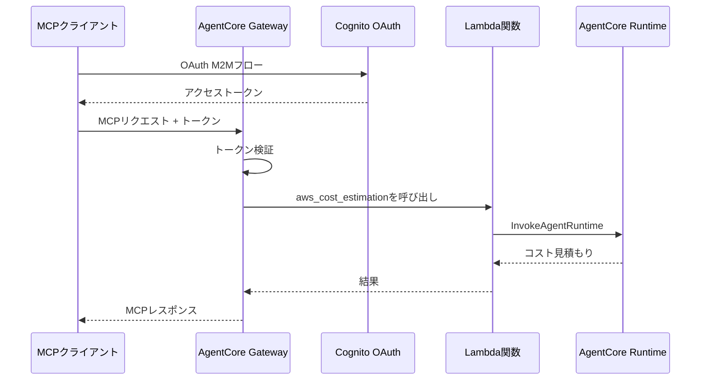

# AgentCore Gateway統合

[English](README.md) / [日本語](README_ja.md)

この実装では、**AgentCore Gateway** とLambda統合を実演し、`02_runtime`のコスト見積もりエージェントをCognito OAuth認証付きのMCPツールとして公開します。

## プロセス概要



## 前提条件

1. **Runtimeデプロイ済み** - まず`02_runtime`セットアップを完了
2. **AWS SAM CLI** - Lambdaデプロイメント用
3. **AWS認証情報** - GatewayとLambda権限付き
4. **依存関係** - `uv`経由でインストール（pyproject.toml参照）

## 使用方法

### ファイル構成

```
03_gateway/
├── README.md                      # このドキュメント
├── template.yaml                  # Lambda用SAMテンプレート
├── src/app.py                     # Lambda関数実装
├── deploy.sh                      # Lambdaデプロイスクリプト
├── create_gateway.py              # Cognito付きGatewayセットアップ
├── test_gateway.py                # Gatewayテストスイート
└── gateway_config.json            # 生成された設定
```

### ステップ1: Lambda関数をデプロイ

```bash
cd 03_gateway
./deploy.sh
```

これにより、SAMを使用してLambda関数がデプロイされ、設定が`gateway_config.json`に保存されます。

### ステップ2: Cognito付きGatewayを作成

```bash
cd 03_gateway
uv run create_gateway.py
```

これにより、OAuth認証とLambdaターゲット統合を備えたGatewayが作成されます。

### ステップ3: Gateway統合をテスト

```bash
cd 03_gateway
# MCPプロトコルでテスト
uv run test_gateway.py --tests mcp

# 直接APIコールでテスト
uv run test_gateway.py --tests api
```

## 主要な実装パターン

### AgentCore Runtime統合を持つLambda関数

```python
def lambda_handler(event, context):
    """Gatewayからのaws_cost_estimationツール呼び出しを処理"""
    try:
        # Gatewayコンテキストからツール名を抽出
        tool_name = context.client_context.custom.get('bedrockAgentCoreToolName', '')
        
        # Gatewayプレフィックスを削除（形式：targetName___toolName）
        if "___" in tool_name:
            tool_name = tool_name.split("___")[-1]
        
        # aws_cost_estimationツールであることを確認
        if tool_name != 'aws_cost_estimation':
            return {'statusCode': 400, 'body': f"不明なツール: {tool_name}"}
        
        # イベントからアーキテクチャの説明を取得
        architecture_description = event.get('architecture_description', '')
        
        # AgentCore Runtimeを呼び出し
        result = invoke_cost_estimator_runtime(runtime_arn, architecture_description)
        
        return {'statusCode': 200, 'body': result}
        
    except Exception as e:
        logger.exception(f"リクエスト処理エラー: {e}")
        return {'statusCode': 500, 'body': f"エラー: {str(e)}"}
```

### Cognito OAuthを使用したGateway作成

```python
def main():
    """LambdaターゲットとCognito認証を持つGatewayを作成"""
    # Gatewayクライアントを初期化
    client = GatewayClient(region_name=boto3.Session().region_name)
    
    # ステップ1: Cognito OAuthオーソライザーを作成
    cognito_result = client.create_oauth_authorizer_with_cognito("AWSCostEstimationResourceServer")
    
    # ステップ2: MCP Gatewayを作成
    gateway = client.create_mcp_gateway(
        name="AWSCostEstimationGateway",
        role_arn=None,
        authorizer_config=cognito_result["authorizer_config"],
        enable_semantic_search=False
    )
    
    # ステップ3: ツールスキーマでLambdaターゲットを追加
    tool_schema = [{
        "name": "aws_cost_estimation",
        "description": "指定されたアーキテクチャ記述のAWSコストを見積もる",
        "inputSchema": {
            "type": "object",
            "properties": {
                "architecture_description": {
                    "type": "string",
                    "description": "コストを見積もるためのAWSアーキテクチャの説明"
                }
            },
            "required": ["architecture_description"]
        }
    }]
    
    create_request = {
        "gatewayIdentifier": gateway["gatewayId"],
        "name": "AWSCostEstimationLambdaTarget",
        "targetConfiguration": {
            "mcp": {
                "lambda": {
                    "lambdaArn": lambda_arn,
                    "toolSchema": {"inlinePayload": tool_schema}
                }
            }
        },
        "credentialProviderConfigurations": [{"credentialProviderType": "GATEWAY_IAM_ROLE"}]
    }
```

### MCPクライアントテストパターン

```python
def test_with_mcp_client(gateway_url, token):
    """Strands Agents経由でMCPクライアントを使用してGatewayをテスト"""
    def create_streamable_http_transport():
        return streamablehttp_client(
            gateway_url, 
            headers={"Authorization": f"Bearer {token}"}
        )
    
    # 認証付きMCPクライアントを作成
    mcp_client = MCPClient(create_streamable_http_transport)
    
    with mcp_client:
        # 利用可能なツールをリスト
        tools = get_full_tools_list(mcp_client)
        tool_names = [tool.tool_name for tool in tools]
        
        # コスト見積もりツールを見つけて呼び出し
        for tool in tools:
            if 'aws_cost_estimation' in tool.tool_name:
                result = mcp_client.call_tool_sync(
                    tool_name=tool.tool_name,
                    arguments={"architecture_description": "ALB + 2x EC2 t3.mediumを使用したWebアプリケーション"}
                )
                return result.content
```

## 使用例

```python
# LambdaをデプロイしてGatewayを作成
./deploy.sh
uv run create_gateway.py

# Gateway経由でコスト見積もりをテスト
from test_gateway import test_with_mcp_client, get_oauth_token

config = load_config()
token = get_oauth_token(config)
result = test_with_mcp_client(config['gateway_url'], token)
print(result)
```

## 統合の利点

- **サーバーレスアーキテクチャ** - Lambdaは需要に応じて自動的にスケール
- **OAuthセキュリティ** - Cognitoがエンタープライズグレードの認証を提供
- **MCP互換性** - ツール統合のための標準プロトコル
- **Runtime再利用** - 既存のAgentCore Runtimeデプロイメントを活用

## 参考資料

- [AgentCore Gateway開発者ガイド](https://docs.aws.amazon.com/bedrock-agentcore/latest/devguide/gateway.html)
- [AWS SAMドキュメント](https://docs.aws.amazon.com/serverless-application-model/)
- [Cognito OAuth統合](https://docs.aws.amazon.com/cognito/latest/developerguide/cognito-user-pools-app-integration.html)
- [MCPプロトコル仕様](https://modelcontextprotocol.io/introduction)

---

**次のステップ**: アプリケーションでGatewayをMCPサーバーとして使用するか、AgentCore Identityと統合してセキュリティを強化しましょう。