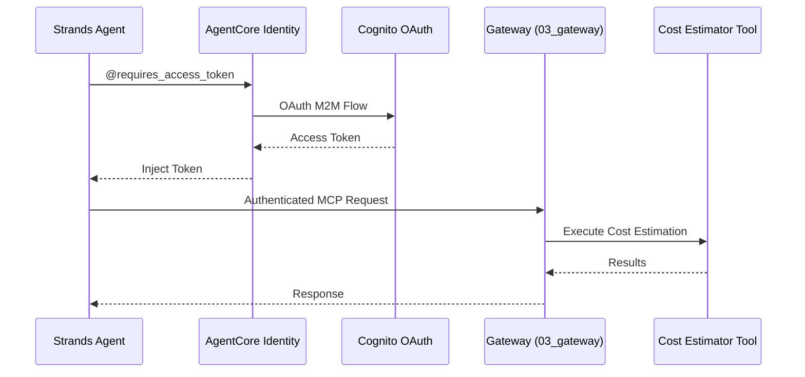

# AgentCore Identity Integration

[English](README.md) / [日本語](README_ja.md)

This implementation demonstrates **AgentCore Identity** with OAuth 2.0 authentication using the existing Cognito M2M setup from the Gateway. The `@requires_access_token` decorator provides transparent token management for secure agent operations.

## Process Overview



## Prerequisites

1. **Gateway deployed** - Complete `03_gateway` setup first
2. **AWS credentials** - With `bedrock-agentcore-control` permissions
3. **Dependencies** - Installed via `uv` (see pyproject.toml)

## How to use

### File Structure

```
04_identity/
├── README.md                      # This documentation
├── setup_credential_provider.py   # OAuth2 provider setup
├── agent_with_identity.py         # Main agent implementation  
└── test_identity_agent.py         # Test suite
```

### Step 1: Create OAuth2 Credential Provider

```bash
cd 04_identity
uv run python setup_credential_provider.py
```

This will create an AgentCore Identity provider using your existing Cognito configuration.

### Step 2: Test Implementation

```bash
cd 04_identity
uv run python test_identity_agent.py
```

This will run comprehensive tests including authentication, cost estimation, and token caching.

## Key Implementation Pattern

### Using @requires_access_token

```python
from bedrock_agentcore.identity.auth import requires_access_token

@requires_access_token(
    provider_name="agentcore-identity-for-gateway",
    scopes=["AWSCostEstimationResourceServer/invoke"],
    auth_flow="M2M",
    force_authentication=False
)    
async def get_token(*, access_token: str) -> str:
    """Access token is automatically injected by the decorator"""
    return access_token
```

### Two-Step Authentication Pattern

```python
# Step 1: Get access token via AgentCore Identity
access_token = await agent.get_access_token()

# Step 2: Create authenticated MCP client
mcp_client = MCPClient(lambda: streamablehttp_client(
    gateway_url, 
    headers={"Authorization": f"Bearer {access_token}"}
))
```

## Usage Example

```python
from agent_with_identity import AgentWithIdentity

agent = AgentWithIdentity()
result = await agent.estimate_costs("""
    A web application with:
    - ALB + 2x EC2 t3.medium
    - RDS MySQL db.t3.micro
    - S3 + CloudFront
""")
print(result)
```

## Security Benefits

- **Zero token exposure** - Tokens never appear in logs/code
- **Automatic lifecycle management** - AgentCore handles expiration
- **Infrastructure reuse** - Leverages existing Gateway security
- **M2M authentication** - Suitable for automated systems

## References

- [AgentCore Identity Developer Guide](https://docs.aws.amazon.com/bedrock-agentcore/latest/devguide/identity.html)
- [OAuth 2.0 Client Credentials Flow](https://tools.ietf.org/html/rfc6749#section-4.4)
- [Cognito OAuth Integration](https://docs.aws.amazon.com/cognito/latest/developerguide/cognito-user-pools-app-integration.html)
- [Strands Agents Documentation](https://github.com/aws-samples/strands-agents)

---

**Next Steps**: Integrate identity-protected agents into your applications using the patterns demonstrated here.
