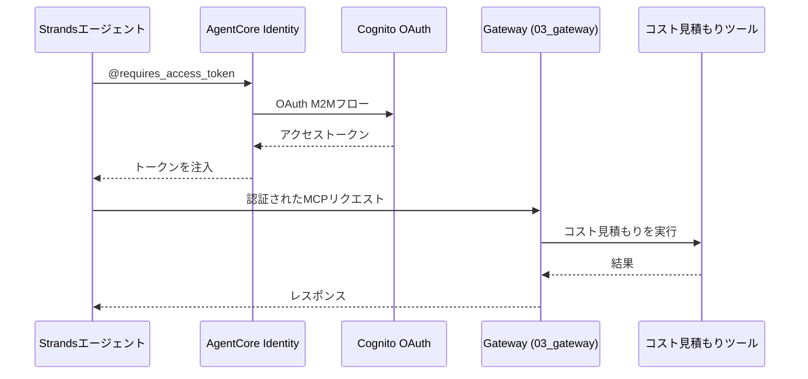

# AgentCore Identity統合

[English](README_en.md) / [日本語](README.md)

この実装では、Gatewayからの既存のCognito M2Mセットアップを使用したOAuth 2.0認証を備えた **AgentCore Identity** を実演します。`@requires_access_token`デコレーターは、セキュアなエージェント操作のための透過的なトークン管理を提供します。

## プロセス概要



## 前提条件

1. **Gatewayデプロイ済み** - まず`03_gateway`セットアップを完了
2. **AWS認証情報** - `bedrock-agentcore-control`権限付き
3. **依存関係** - `uv`経由でインストール（pyproject.toml参照）

## 使用方法

### ファイル構成

```
04_identity/
├── README.md                      # このドキュメント
├── setup_credential_provider.py   # OAuth2プロバイダーセットアップ
├── agent_with_identity.py         # メインエージェント実装  
└── test_identity_agent.py         # テストスイート
```

### ステップ1: OAuth2認証プロバイダーを作成

```bash
cd 04_identity
uv run python setup_credential_provider.py
```

これにより、既存のCognito設定を使用してAgentCore Identityプロバイダーが作成されます。

### ステップ2: 実装をテスト

```bash
cd 04_identity
uv run python test_identity_agent.py
```

これにより、認証、コスト見積もり、トークンキャッシングを含む包括的なテストが実行されます。

## 主要な実装パターン

### @requires_access_tokenの使用

```python
from bedrock_agentcore.identity.auth import requires_access_token

@requires_access_token(
    provider_name="agentcore-identity-for-gateway",
    scopes=["AWSCostEstimationResourceServer/invoke"],
    auth_flow="M2M",
    force_authentication=False
)    
async def get_token(*, access_token: str) -> str:
    """アクセストークンはデコレーターによって自動的に注入されます"""
    return access_token
```

### 2段階認証パターン

```python
# ステップ1: AgentCore Identity経由でアクセストークンを取得
access_token = await agent.get_access_token()

# ステップ2: 認証されたMCPクライアントを作成
mcp_client = MCPClient(lambda: streamablehttp_client(
    gateway_url, 
    headers={"Authorization": f"Bearer {access_token}"}
))
```

## 使用例

```python
from agent_with_identity import AgentWithIdentity

agent = AgentWithIdentity()
result = await agent.estimate_costs("""
    次を含むWebアプリケーション：
    - ALB + 2x EC2 t3.medium
    - RDS MySQL db.t3.micro
    - S3 + CloudFront
""")
print(result)
```

## セキュリティの利点

- **ゼロトークン露出** - トークンはログ/コードに表示されない
- **自動ライフサイクル管理** - AgentCoreが有効期限を処理
- **インフラストラクチャの再利用** - 既存のGatewayセキュリティを活用
- **M2M認証** - 自動化システムに適している

## 参考資料

- [AgentCore Identity開発者ガイド](https://docs.aws.amazon.com/bedrock-agentcore/latest/devguide/identity.html)
- [OAuth 2.0クライアント認証フロー](https://tools.ietf.org/html/rfc6749#section-4.4)
- [Cognito OAuth統合](https://docs.aws.amazon.com/cognito/latest/developerguide/cognito-user-pools-app-integration.html)
- [Strands Agentsドキュメント](https://github.com/aws-samples/strands-agents)

---

**次のステップ**: ここで実演されたパターンを使用して、アイデンティティ保護されたエージェントをアプリケーションに統合しましょう。